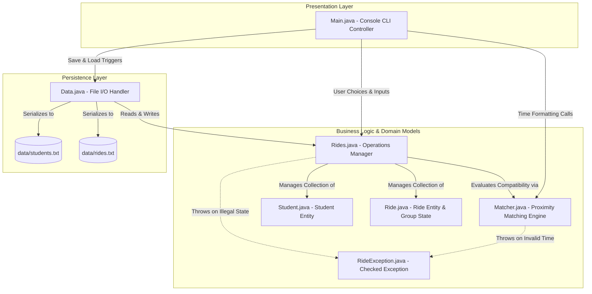
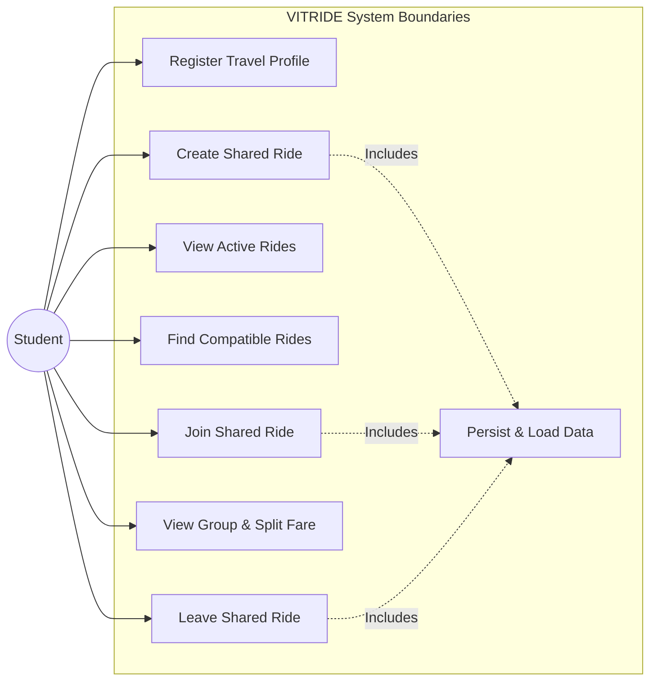
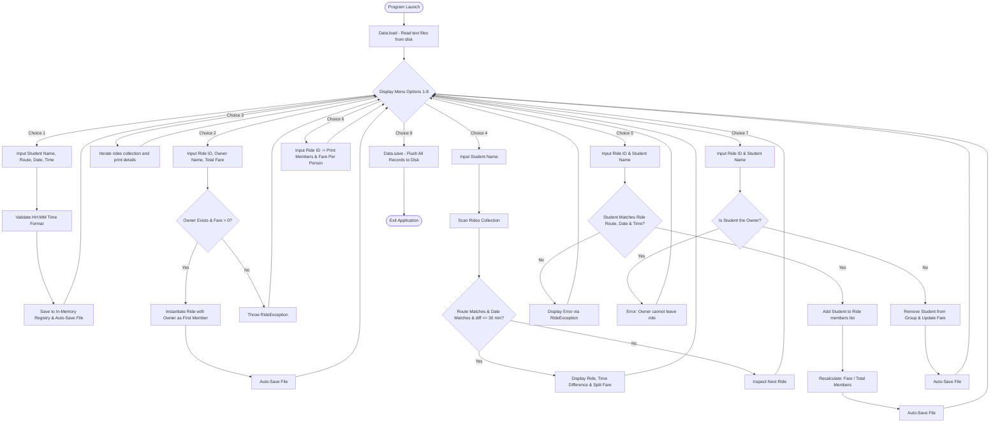
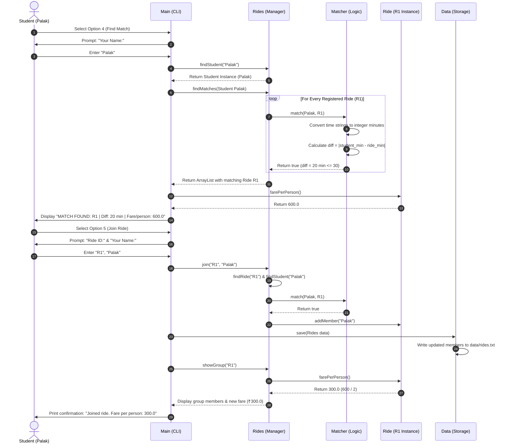
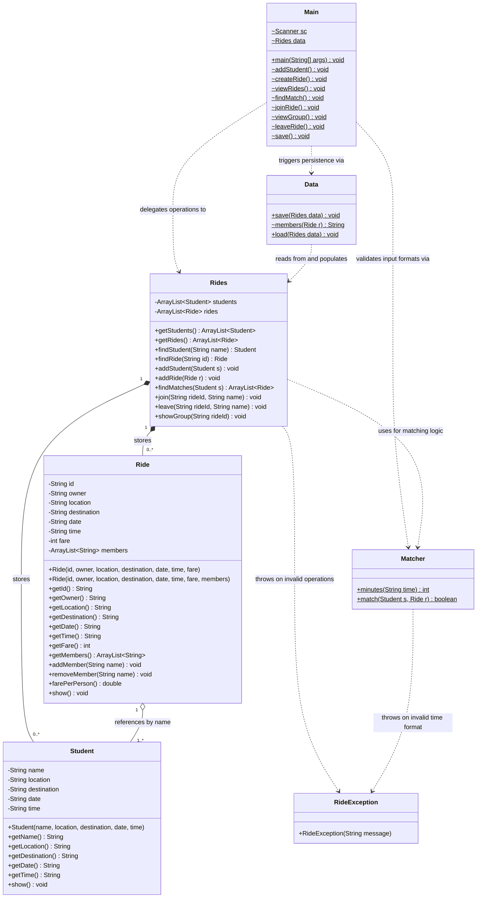
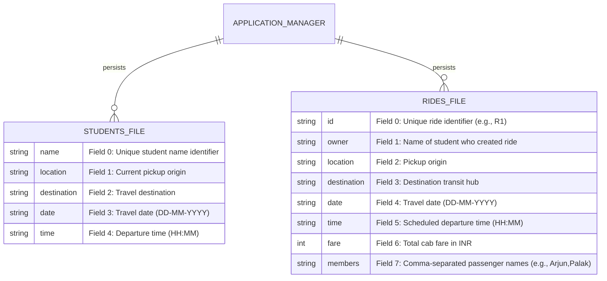

<div align="center">

# VIT BHOPAL UNIVERSITY

### VITYARTHI
### PROGRAMMING IN JAVA (CSE2006)
### ACADEMIC YEAR: 2026–27

<br>
<br>

# PROJECT REPORT
## ON
# VITRIDE: CAMPUS CAB-SHARING AND FARE-SPLITTING SYSTEM

<br>
<br>

**SUBMITTED BY:**  
**NAME:** MD JAHIRUDDIN AHMED  
**REGISTER NUMBER:** 25BAI11468  
**PROGRAM:** B.TECH CSE (ARTIFICIAL INTELLIGENCE AND MACHINE LEARNING)  

<br>
<br>

</div>

\pagebreak

---

## TABLE OF CONTENTS

1. [COVER PAGE](#1-cover-page)
2. [INTRODUCTION](#2-introduction)
3. [PROBLEM STATEMENT](#3-problem-statement)
4. [FUNCTIONAL REQUIREMENTS](#4-functional-requirements)
5. [NON-FUNCTIONAL REQUIREMENTS](#5-non-functional-requirements)
6. [SYSTEM ARCHITECTURE](#6-system-architecture)
7. [DESIGN DIAGRAMS](#7-design-diagrams)
   - 7.1 [Use Case Diagram](#71-use-case-diagram)
   - 7.2 [Workflow Diagram](#72-workflow-diagram)
   - 7.3 [Sequence Diagram](#73-sequence-diagram)
   - 7.4 [Class Diagram](#74-class-diagram)
   - 7.5 [Storage Design Diagram](#75-storage-design-diagram)
8. [DESIGN DECISIONS & RATIONALE](#8-design-decisions--rationale)
9. [IMPLEMENTATION DETAILS](#9-implementation-details)
10. [SCREENSHOTS / RESULTS](#10-screenshots--results)
11. [TESTING APPROACH](#11-testing-approach)
12. [CHALLENGES FACED](#12-challenges-faced)
13. [LEARNINGS & KEY TAKEAWAYS](#13-learnings--key-takeaways)
14. [FUTURE ENHANCEMENTS](#14-future-enhancements)
15. [REFERENCES](#15-references)

---

## 1. COVER PAGE
The formal details of this project submission are presented on the preceding cover sheet:
- **Course Name:** Programming in Java
- **Course Code:** CSE2006
- **Academic Year:** 2026–27
- **Project Title:** VITRIDE: CAMPUS CAB-SHARING AND FARE-SPLITTING SYSTEM
- **Submitted by:** MD JAHIRUDDIN AHMED (Reg. No: 25BAI11468)
- **Degree Program:** B.Tech CSE (Artificial Intelligence and Machine Learning)
- **Institution:** VIT Bhopal University

---

## 2. INTRODUCTION

**VITRIDE** is an interactive, terminal-based Core Java application designed specifically to solve a common logistical problem faced by university students: coordinating shared cab travel to and from transit hubs and distributing travel expenses equitably.

### 2.1 Context and Motivation
VIT Bhopal University is situated along the Bhopal-Indore highway, away from primary urban transit nodes such as Bhopal Junction, Rani Kamlapati Railway Station, and Raja Bhoj Airport. During weekend leaves, festival breaks, and semester holidays, hundreds of residential students travel to identical destinations at roughly the same times. However, because students lack a centralized platform to discover each other's schedules, they often book individual cabs or travel in partially filled taxis. This leads to:
- Excessive individual travel expenses (often ₹600 to ₹1,500 per one-way ride).
- Coordination overhead on fragmented chat groups where travel messages get buried quickly.
- Unnecessary vehicle congestion and poor resource utilization.

### 2.2 Project Scope & Architectural Choice
VITRIDE addresses this challenge through a structured command-line solution that matches students traveling along identical routes on the same date whose departure preferences fall within a **30-minute time window**. When co-passengers join a shared ride, the system automatically computes an equal split of the total cab fare, lowering travel expenses for all participants.

A **Command-Line Interface (CLI)** architecture using pure Java (Standard Edition) was chosen intentionally to:
1. Emphasize object-oriented programming principles, modular software organization, algorithmic problem solving, robust exception handling, and persistent file I/O without the distraction of GUI frameworks.
2. Ensure lightweight, deterministic execution that runs in headless evaluation servers and operating system terminals with zero external runtime dependencies.

---

## 3. PROBLEM STATEMENT

Students residing at residential university campuses regularly travel to airport terminals, railway stations, and city bus stands. Booking individual cabs results in significant financial strain on students, while multiple vehicles travel along the same highway corridors with empty seats.

Attempting to coordinate shared rides manually through instant messaging groups is disorganized: messages disappear in active chats, departure time constraints are frequently mismatched, and calculating individual financial contributions causes confusion.

### Project Objective:
The objective of **VITRIDE** is to provide a clean, modular command-line software application that:
- Captures and stores student travel itineraries (origin, destination, date, and preferred departure time).
- Allows students to post shared rides with an associated total fare.
- Executes an automated proximity-matching algorithm to identify active rides within a 30-minute departure window.
- Enables students to join or leave rides while dynamically updating passenger rosters and splitting the total fare equally.
- Retains all student and ride records across application restarts using local, human-readable file persistence.

---

## 4. FUNCTIONAL REQUIREMENTS

The capabilities of VITRIDE are organized into six distinct functional modules:

### 4.1 Student Management Module
- **Description:** Manages the registration and indexing of student travel profiles.
- **Input:** Student name, current location, destination, travel date (`DD-MM-YYYY`), and preferred start time (`HH:MM`).
- **Processing:** Validates time format (`HH:MM` with numeric boundaries `0 <= HH <= 23` and `0 <= MM <= 59`), checks whether the student name is already registered, creates a `Student` entity, and appends it to the in-memory registry.
- **Output:** Confirmation message (`"Student added."`) or validation error if details are malformed or duplicate.

### 4.2 Ride Creation Module
- **Description:** Allows an existing registered student to initiate a new shared ride.
- **Input:** Unique Ride ID, student owner name, and total estimated cab fare in INR.
- **Processing:** Verifies that the owner exists in the student registry, verifies that the Ride ID is not a duplicate, validates that the fare is a positive integer, retrieves the owner's stored itinerary (location, destination, date, time), instantiates a new `Ride` object with the creator as the first member, and registers it.
- **Output:** Confirmation message (`"Ride created."`) and display of the ride details.

### 4.3 Ride Listing Module
- **Description:** Provides transparency by listing all active rides stored in the system.
- **Input:** User selection from menu (Option 3).
- **Processing:** Iterates through the collection of registered `Ride` objects.
- **Output:** Formatted console output showing Ride ID, route, travel date, departure time, total fare, and current passenger count.

### 4.4 Ride Matching Module
- **Description:** Discovers existing rides that match a student's itinerary within an acceptable time window.
- **Input:** Inquiring student's registered name.
- **Processing:** Retrieves the student's route, date, and time. Scans the active ride collection, discarding rides where the student is the owner. Compares pickup location and destination (case-insensitive string comparison) and date (exact match). Computes the absolute time difference in minutes between departure times; if $\le 30$ minutes, marks the ride as compatible.
- **Output:** List of compatible rides displaying route, scheduled time, calculated time difference in minutes, and the projected fare per person.

### 4.5 Group Management & Fare Splitting Module
- **Description:** Handles co-passenger onboarding, departure, and dynamic cost division.
- **Input:** Ride ID and student name for joining or leaving.
- **Processing:**
  - *Join:* Verifies the ride and student exist, ensures the student is not already a member, verifies route and 30-minute time compatibility via `Matcher.match()`, and appends the student to the group roster.
  - *Leave:* Verifies membership, prevents the original ride creator/owner from abandoning the ride, and removes the passenger.
  - *Fare Calculation:* Evaluates $\text{Fare Per Person} = \frac{\text{Total Fare}}{\text{Group Size}}$.
- **Output:** Updated group roster showing all passenger details and the adjusted per-person fare share.

### 4.6 Data Persistence Module
- **Description:** Provides non-volatile persistence for application records without an external database.
- **Input:** In-memory collections of `Student` and `Ride` objects on save; `data/students.txt` and `data/rides.txt` on load.
- **Processing:** Serializes records into pipe-delimited (`|`) strings and writes them to local storage using `BufferedWriter`. Upon application startup, parses the files using `BufferedReader` and reconstructs the in-memory object graphs.
- **Output:** Persistent storage on disk; restored application state on restart.

---

## 5. NON-FUNCTIONAL REQUIREMENTS

| Requirement | Specification in VITRIDE |
| :--- | :--- |
| **Performance** | In-memory lookup, time parsing, and matching operations execute in $\mathcal{O}(N)$ linear time relative to active rides, completing in less than 5 milliseconds on consumer hardware. |
| **Usability** | Interactive, numbered terminal menu interface (Options 1–8) with intuitive prompts and explicit formatting guidelines (`DD-MM-YYYY` for dates and `HH:MM` for times). |
| **Reliability** | Comprehensive input validation and custom exception handling (`RideException`) prevent runtime crashes caused by malformed inputs or illegal business states. |
| **Maintainability** | Clean separation of concerns across 7 distinct Java classes (`Student`, `Ride`, `Matcher`, `Rides`, `Data`, `Main`, `RideException`), each with single-responsibility encapsulation. |
| **Error Handling** | Granular defensive validation for time limits, empty fields, negative fares, non-existent records, and unauthorized actions (e.g., owner attempting to leave their own ride). |
| **Resource Efficiency** | Minimal memory footprint (< 30 MB JVM heap) with zero background daemon threads, running on standard Java Runtime Environments without third-party frameworks. |

---

## 6. SYSTEM ARCHITECTURE

VITRIDE follows a decoupled, three-tier architectural model adapted for command-line execution:

1. **Presentation / Interaction Layer (`Main.java`):** Captures user inputs through `java.util.Scanner`, validates basic input formats, invokes business logic methods, and renders formatted responses to `System.out`.
2. **Business Logic & Service Layer (`Rides.java`, `Matcher.java`, `Ride.java`, `Student.java`):** Maintains the domain models, encapsulates business rules, performs interval-based arithmetic, and enforces constraints via `RideException`.
3. **Persistence Layer (`Data.java`):** Interacts with the filesystem using character stream buffers (`BufferedReader`/`BufferedWriter`) to persist and retrieve domain entities to and from the `data/` directory.

### Architecture Diagram



---

## 7. DESIGN DIAGRAMS

### 7.1 Use Case Diagram

The use case diagram illustrates the interactions between the Student (actor) and the available services in VITRIDE.



---

### 7.2 Workflow Diagram

The workflow diagram tracks the operational lifecycle from system startup through menu selection, matching, joining, fare recalculation, and shutdown.



---

### 7.3 Sequence Diagram

The sequence diagram illustrates the primary end-to-end execution flow: a student searches for a compatible ride, receives recommendations, joins the group, and causes the system to recalculate the fare and save the new state.



---

### 7.4 Class Diagram

The UML class diagram reflects the exact classes, private attributes, public methods, and relationships found in the source code.



---

### 7.5 Storage Design Diagram

Rather than employing a heavy relational database, VITRIDE utilizes structured local text files with pipe-delimited records.



#### Record Format Specifications:
1. **`data/students.txt` Structure:**
   ```text
   Arjun|VIT Bhopal|Airport|20-09-2026|17:00
   Palak|VIT Bhopal|Airport|20-09-2026|17:20
   ```
2. **`data/rides.txt` Structure:**
   ```text
   R1|Arjun|VIT Bhopal|Airport|20-09-2026|17:00|600|Arjun,Palak
   ```

---

## 8. DESIGN DECISIONS & RATIONALE

| Decision | Rationale | Engineering Benefit |
| :--- | :--- | :--- |
| **Pure Core Java (JDK Standard Libraries)** | The assignment emphasizes evaluating Core Java competency (OOP, collections, file I/O, exceptions). | Eliminates dependency conflicts, third-party version mismatches, and build tool complexities. |
| **Command-Line Interface (CLI)** | The project brief requires command-line execution and penalizes mandatory GUI setups. | Ensures compatibility with headless evaluation servers and Linux grading containers without GUI overhead. |
| **`ArrayList` for Collections** | Passenger lists and ride registries have dynamic sizes and require fast traversal during matching. | Provides constant-time $\mathcal{O}(1)$ random access, low memory overhead, and straightforward iteration. |
| **Custom Checked Exception (`RideException`)** | Domain-specific violations (duplicate students, invalid time formats, illegal departures) should be handled explicitly. | Enforces clean error propagation, improves maintainability, and prevents uncaught runtime crashes. |
| **Flat File Delimited Storage (`Data.java`)** | Student cab-sharing requires simple data persistence across restarts without setup friction. | Human-readable files, zero database installation/configuration, zero background daemon overhead. |
| **Integer Minute Arithmetic** | Comparing string-based times directly is error-prone when calculating boundaries and intervals. | Converting `HH:MM` into total minutes allows exact difference calculation: $|\text{min}_1 - \text{min}_2| \le 30$. |
| **30-Minute Matching Window** | Students travelling on the same highway route cannot be expected to leave at the exact same minute. | Strikes a realistic balance between passenger schedule flexibility and vehicle departure coordination. |

---

## 9. IMPLEMENTATION DETAILS

### 9.1 Student Management (`Student.java`)
The `Student` class serves as the core domain entity representing an individual student's travel plan. It enforces encapsulation by maintaining all attributes as private and exposing public getters:

```java
public class Student {
    private String name, location, destination, date, time;

    public Student(String name, String location, String destination,
                   String date, String time) {
        this.name = name;
        this.location = location;
        this.destination = destination;
        this.date = date;
        this.time = time;
    }
    // Getters and show() method
}
```

### 9.2 Ride Management & State (`Ride.java`)
The `Ride` class represents a shared cab journey. It manages its own passenger list (`ArrayList<String> members`) and initializes the creator as the first passenger:

```java
public Ride(String id, String owner, String location,
            String destination, String date,
            String time, int fare) {
    this.id = id;
    this.owner = owner;
    this.location = location;
    this.destination = destination;
    this.date = date;
    this.time = time;
    this.fare = fare;
    this.members = new ArrayList<String>();
    this.members.add(owner);
}
```

### 9.3 Time-Window Matching Engine (`Matcher.java`)
The `Matcher` class contains static utility methods that translate time representations into integers and evaluate compatibility:

```java
public static int minutes(String time) throws RideException {
    if (time == null || time.length() != 5 || time.charAt(2) != ':')
        throw new RideException("Use HH:MM format.");

    int h = (time.charAt(0) - '0') * 10 + (time.charAt(1) - '0');
    int m = (time.charAt(3) - '0') * 10 + (time.charAt(4) - '0');

    if (h < 0 || h > 23 || m < 0 || m > 59)
        throw new RideException("Invalid time.");

    return h * 60 + m;
}

public static boolean match(Student s, Ride r) throws RideException {
    if (!s.getLocation().equalsIgnoreCase(r.getLocation())) return false;
    if (!s.getDestination().equalsIgnoreCase(r.getDestination())) return false;
    if (!s.getDate().equals(r.getDate())) return false;
    if (s.getName().equalsIgnoreCase(r.getOwner())) return false;

    int a = minutes(s.getTime());
    int b = minutes(r.getTime());
    int diff = Math.abs(a - b);

    return diff <= 30;
}
```

### 9.4 Operations and Collection Management (`Rides.java`)
The `Rides` class functions as the in-memory service manager. It coordinates business logic constraints:
- Enforcing uniqueness of student names and Ride IDs.
- Validating that positive fares are entered.
- Ensuring that non-members cannot leave a ride and that the original owner cannot abandon their created ride.

### 9.5 Dynamic Equal Fare Calculation
In `Ride.java`, fare calculation is executed dynamically based on the current passenger list size:

```java
public double farePerPerson() {
    return (double) fare / members.size();
}
```
When a ride is created with a ₹600 fare and 1 member, `farePerPerson()` returns `600.0`. When a second student joins, `members.size()` becomes 2, automatically returning `300.0`. If a third student joins, it computes `200.0`.

### 9.6 File Persistence (`Data.java`)
The `Data` class provides static serialization and deserialization routines.
- It guarantees that the storage directory exists using `new File("data").mkdirs()`.
- It writes records line-by-line using `BufferedWriter.write()` and `newLine()`.
- When reading from disk using `BufferedReader.readLine()`, it splits tokens using `line.split("\\|", -1)` to handle empty collections safely.

### 9.7 Custom Checked Exception (`RideException.java`)
Inheriting from `java.lang.Exception`, `RideException` encapsulates application-specific error conditions, ensuring that business rule violations are cleanly surfaced to the user without crashing the JVM:

```java
public class RideException extends Exception {
    public RideException(String message) {
        super(message);
    }
}
```

---

## 10. SCREENSHOTS / RESULTS

The screenshots below show the application running in the terminal and demonstrate the core features:

### 10.1 Interactive Main Menu


*Result 1: Main menu interface offering options 1 through 8.*

---

### 10.2 Student Registration & Itinerary Input
```text
===== VITRIDE =====
1. Add Student
2. Create Ride
3. View Rides
4. Find Match
5. Join Ride
6. View Group
7. Leave Ride
8. Exit
Choice: 1
Name: Arjun
Current Location: VIT Bhopal
Going To: Airport
Date (DD-MM-YYYY): 20-09-2026
Start Time (HH:MM): 17:00
Student added.

Choice: 1
Name: Palak
Current Location: VIT Bhopal
Going To: Airport
Date (DD-MM-YYYY): 20-09-2026
Start Time (HH:MM): 17:20
Student added.
```
*Result 2: Registering two students traveling on the same highway corridor 20 minutes apart.*

---

### 10.3 Ride Creation and Active Ride Listing
```text
Choice: 2
Ride ID: R1
Your Name: Arjun
Total Fare: 600
Ride created.

Choice: 3
R1 | VIT Bhopal -> Airport | 20-09-2026 | 17:00 | Fare: 600 | Members: 1
```
*Result 3: Creation of shared ride R1 with an initial fare of ₹600 allocated to the creator.*

---

### 10.4 30-Minute Proximity Match Discovery
```text
Choice: 4
Your Name: Palak

MATCH FOUND
R1 | VIT Bhopal -> Airport | 20-09-2026 | 17:00 | Fare: 600 | Members: 1
Time difference: 20 minutes
Fare per person: 600.0
```
*Result 4: Option 4 identifies ride R1 as a match (20-minute gap $\le 30$) and shows the initial fare.*

---

### 10.5 Group Joining and Dynamic Fare Splitting
```text
Choice: 5
Ride ID: R1
Your Name: Palak
Joined ride.
R1 | VIT Bhopal -> Airport | 20-09-2026 | 17:00 | Fare: 600 | Members: 2
Members:
Arjun | VIT Bhopal -> Airport | 20-09-2026 | 17:00
Palak | VIT Bhopal -> Airport | 20-09-2026 | 17:20
Fare per person: 300.0
```
*Result 5: Palak joins ride R1, reducing the individual fare share from ₹600.0 to ₹300.0.*

---

### 10.6 Automated Test Suite Execution
```text
$ javac -d testout src/*.java tests/MatcherTest.java
$ java -cp testout MatcherTest
All tests passed.
```
*Result 6: Successful command-line compilation and execution of automated unit tests.*

---

## 11. TESTING APPROACH

Testing was conducted using a dedicated automated test driver (`tests/MatcherTest.java`) alongside manual boundary-condition checks in the terminal.

### 11.1 Test Driver Architecture
The `MatcherTest` class tests the core matching algorithm directly in code without requiring interactive console inputs. It uses an assertion helper:
```java
static void check(boolean x, String msg) {
    if (!x) throw new RuntimeException(msg);
}
```

### 11.2 Test Execution Commands
The test suite is compiled and run from the repository root using the following commands:
```bash
mkdir -p testout
javac -d testout src/*.java tests/MatcherTest.java
java -cp testout MatcherTest
```

### 11.3 Verified Test Results Matrix

All 6 automated test cases were executed and passed:

| Test ID | Objective | Input / Condition | Expected Behavior | Actual Result | Status |
| :--- | :--- | :--- | :--- | :--- | :--- |
| **TC-01** | Proximity Match | Route: `VIT Bhopal -> Airport`, Date: `20-09-2026`, Times: `17:00` vs `17:20` ($\Delta = 20\text{ min}$) | `Matcher.match()` returns `true` | Returned `true` | **PASS** |
| **TC-02** | Time Boundary | Same route/date, Times: `17:00` vs `18:00` ($\Delta = 60\text{ min}$) | `Matcher.match()` returns `false` | Returned `false` | **PASS** |
| **TC-03** | Route Filter | Same date/time, Destinations: `Airport` vs `Station` | `Matcher.match()` returns `false` | Returned `false` | **PASS** |
| **TC-04** | Date Filter | Same route/time, Dates: `20-09-2026` vs `21-09-2026` | `Matcher.match()` returns `false` | Returned `false` | **PASS** |
| **TC-05** | Self-Match Filter | Student `Arjun` evaluates ride owned by `Arjun` | `Matcher.match()` returns `false` | Returned `false` | **PASS** |
| **TC-06** | Fare Division | Ride fare ₹600, 2 passengers (`Arjun`, `Priya`) | `r1.farePerPerson() == 300.0` | Evaluated `300.0` | **PASS** |

---

## 12. CHALLENGES FACED

1. **Robust Time Parsing Without Third-Party Frameworks:**
   - *Problem:* While Java 8 provides `java.time.LocalTime`, parsing and comparing string inputs across various platforms often causes format exceptions.
   - *Solution:* Implemented manual parsing in `Matcher.minutes()` that validates character lengths, colon placement, and numeric boundaries before converting the time to integer minutes from midnight.

2. **Managing Group State Across Roster Changes:**
   - *Problem:* When passengers join or leave a ride, updating the fare split and preserving data integrity required careful state management.
   - *Solution:* Used dynamic `ArrayList<String>` collections and made `farePerPerson()` compute the split on demand from `members.size()` rather than storing a stale, static value.

3. **Data Integrity in Pipe-Delimited File Storage:**
   - *Problem:* Parsing files with variable numbers of passengers caused `ArrayIndexOutOfBoundsException` when comma-separated lists were empty.
   - *Solution:* Used `line.split("\\|", -1)` in `Data.java` to preserve empty trailing tokens and added validation checks before rebuilding entity collections.

4. **Input Handling in Console Environments:**
   - *Problem:* Mixing `Scanner.nextInt()` with `Scanner.nextLine()` often causes the scanner to skip input lines due to leftover newline characters.
   - *Solution:* Standardized on reading all terminal inputs using `Scanner.nextLine().trim()` and converting types explicitly with `Integer.parseInt()`.

---

## 13. LEARNINGS & KEY TAKEAWAYS

- **Core Object-Oriented Principles:** Applied encapsulation, class modeling, and separation of concerns by separating presentation (`Main`), business rules (`Rides`, `Matcher`), and storage (`Data`).
- **Collections Framework:** Used `ArrayList` to manage dynamic data collections and learned how to safely traverse, filter, and modify lists.
- **Defensive Error Handling:** Created and utilized a custom checked exception (`RideException`) to handle business rule violations cleanly rather than letting runtime errors bubble up.
- **Stream-Based File I/O:** Gained practical experience with character streams (`BufferedReader` and `BufferedWriter`), learning how to serialize and deserialize object state to flat files.
- **Algorithmic Modeling:** Converted temporal comparisons into absolute mathematical differences ($|\Delta t| \le 30$), making matching logic simple, testable, and reliable.
- **Command-Line Tooling & Git:** Developed, compiled, tested, and maintained a project entirely through the terminal, reinforcing good version control habits.

---

## 14. FUTURE ENHANCEMENTS

The following features are identified as potential future enhancements and are not part of the current CLI implementation:

1. **Graphical or Web User Interface:** Developing a web frontend (using React or HTML5/CSS3) or a cross-platform desktop UI to provide visual map displays.
2. **Database Integration:** Replacing flat text files with a relational database (such as PostgreSQL or SQLite via JDBC) to support concurrent access and transactional integrity.
3. **Student Identity Verification:** Adding email verification (e.g., using `@vitbhopal.ac.in` domains) to confirm student identities.
4. **Distance and Route Mapping APIs:** Integrating mapping services (such as Google Maps or OpenStreetMap) to calculate intermediate pickup points along the highway.
5. **Payment Integration:** Adding UPI deep-linking or digital wallet APIs to facilitate direct settlements between students.
6. **Push Notifications:** Adding SMS or mobile push notifications to alert students when a compatible co-passenger posts a ride.

---

## 15. REFERENCES

1. **Oracle Java Documentation:** Standard Java SE 8+ Class Library and Language Specifications.  
   Website: [https://docs.oracle.com/javase/8/docs/api/](https://docs.oracle.com/javase/8/docs/api/)
2. **Java Collections Framework Guide:** Oracle Core Java Documentation on `java.util.ArrayList`.  
   Website: [https://docs.oracle.com/javase/tutorial/collections/](https://docs.oracle.com/javase/tutorial/collections/)
3. **Java I/O (Input/Output) Streams:** Oracle Documentation on `BufferedReader`, `BufferedWriter`, and File Persistence.  
   Website: [https://docs.oracle.com/javase/tutorial/essential/io/](https://docs.oracle.com/javase/tutorial/essential/io/)
4. **Mermaid.js Documentation:** Sequence, Class, and Flowchart Markdown Visualization Standards.  
   Website: [https://mermaid.js.org/](https://mermaid.js.org/)
5. **Project Repository:** Official VITRIDE GitHub Source Code and Release Repository.  
   URL: [https://github.com/jahiruddincse/VITRide](https://github.com/jahiruddincse/VITRide)
